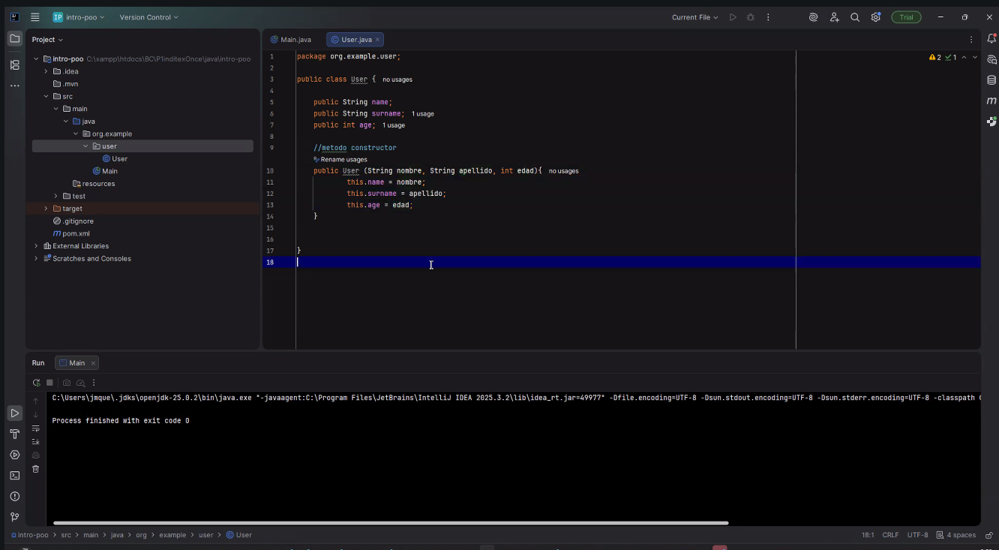

# El Senor de los Anillos (Java)

Este repo es mi practica de POO en Java usando personajes de El Senor de los Anillos. Lo hice para afianzar herencia, encapsulacion y polimorfismo de forma clara: una clase base con lo comun, varias razas que heredan, y un metodo que cambia segun el tipo real del objeto. No es un juego ni un framework, es un ejercicio completo y ordenado para demostrar fundamentos.

Elige tu idioma. dejo dos secciones plegables: una en Espanol y otra en English.

<details open>
  <summary><strong>Espanol</strong></summary>

## Resumen rapido
Este proyecto modela razas de la Tierra Media en Java con una superclase `Personaje` y subclases por raza. En `Main` se instancian varios personajes y se imprime su informacion usando polimorfismo. Si entiendes este codigo, entiendes la base de POO en Java.

## Motivacion y enfoque
Queria un ejemplo que no fuera abstracto. Por eso use personajes conocidos y atributos sencillos. El objetivo es que se vea claro cuando un atributo es comun, cuando pertenece a una raza y como el mismo metodo se comporta distinto segun la clase real.

## Estructura de clases
- `Personaje` es la clase base con lo comun: `nombre`, `edad`, `arma`, `bando`.
- Cada raza (`Humano`, `Elfo`, `Enano`, `Hobbit`, `Orco`) agrega un atributo propio.
- `imprimirDetalles()` vive en la base y se sobreescribe para mostrar lo que cambia en cada raza.
- En `Main` se crean 3 personajes por raza y se imprime todo desde polimorfismo.

## Razas y atributo propio
- `Humano`: `reino`
- `Elfo`: `bosque`
- `Enano`: `clan`
- `Hobbit`: `comarca`
- `Orco`: `tribu`

## Mapa del proyecto
- Codigo principal: `src/main/java/org/example`
- Punto de entrada: `Main`
- Clases de dominio: `Personaje`, `Humano`, `Elfo`, `Enano`, `Hobbit`, `Orco`

## Patrones aplicados (en simple)
No hay patrones de diseno complejos, pero si hay patrones de POO clasicos:
- Herencia para reutilizar lo comun.
- Encapsulacion con atributos `private` y sus getters/setters.
- Polimorfismo cuando se imprime cada personaje con el mismo metodo.
- Sobrescritura para cambiar el comportamiento segun la raza.

La imagen de abajo resume esos patrones dentro del proyecto.



## Ejemplo de salida
```text
Raza: Humano
Nombre: Aragorn
Edad: 87
Arma: Espada
Bando: Bien
Reino: Gondor
-
```

## Como correrlo
1. Abrir el proyecto en IntelliJ.
2. Ejecutar `Main`.
3. Ver la salida en consola.

## Nota del autor
Este repo esta pensado como practica limpia. Me interesa que el codigo se entienda rapido y que la estructura sea clara, sin ruido ni dependencias raras.

</details>

<details>
  <summary><strong>English</strong></summary>

## Quick summary
This project models Middle-earth races in Java with a `Personaje` base class and race-specific subclasses. In `Main` I instantiate several characters and print their details using polymorphism. If you can read this code, you understand core Java OOP.

## Motivation and approach
I wanted a concrete example instead of an abstract one. Known characters make the model easy to follow. The goal is to see what is shared, what is race-specific, and how the same method behaves differently depending on the runtime type.

## Class structure
- `Personaje` is the base class with common fields: `nombre`, `edad`, `arma`, `bando`.
- Each race (`Humano`, `Elfo`, `Enano`, `Hobbit`, `Orco`) adds its own field.
- `imprimirDetalles()` is defined in the base and overridden per race.
- `Main` creates 3 characters per race and prints everything using polymorphism.

## Races and specific field
- `Humano`: `reino`
- `Elfo`: `bosque`
- `Enano`: `clan`
- `Hobbit`: `comarca`
- `Orco`: `tribu`

## Project map
- Main code: `src/main/java/org/example`
- Entry point: `Main`
- Domain classes: `Personaje`, `Humano`, `Elfo`, `Enano`, `Hobbit`, `Orco`

## Patterns used (simple)
No advanced design patterns here, but classic OOP patterns are present:
- Inheritance to reuse shared state.
- Encapsulation using `private` fields and getters/setters.
- Polymorphism when printing each character with the same method.
- Overriding to change behavior per race.

The image below summarizes those patterns in the project.


## Sample output
```text
Raza: Humano
Nombre: Aragorn
Edad: 87
Arma: Espada
Bando: Bien
Reino: Gondor
-
```

## How to run
1. Open the project in IntelliJ.
2. Run `Main`.
3. Check the console output.

## Author note
This repo is a clean practice project. The goal is readable code and a clear structure without extra noise or heavy dependencies.

</details>
